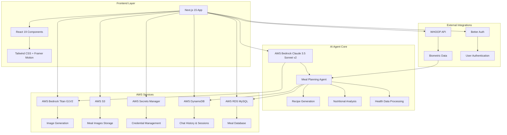
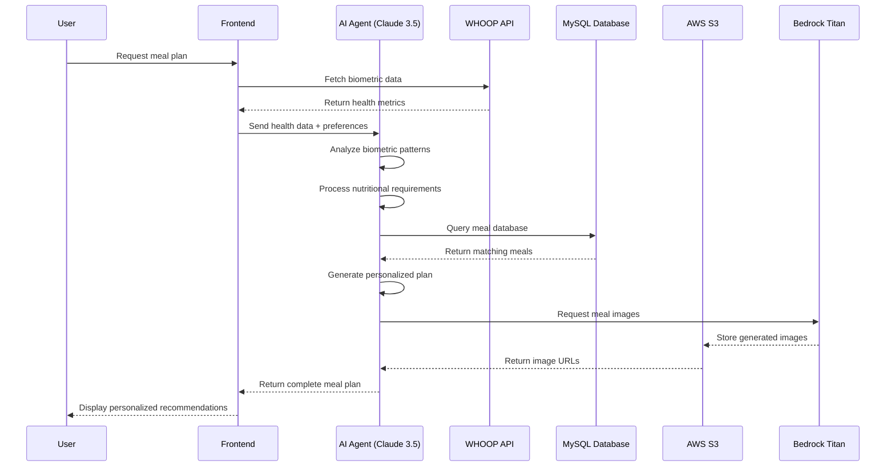
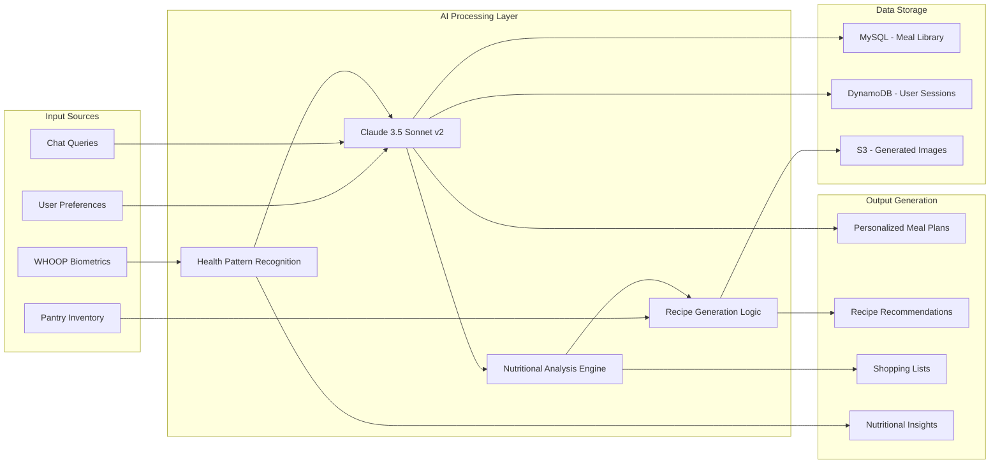
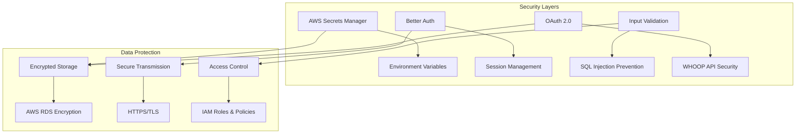
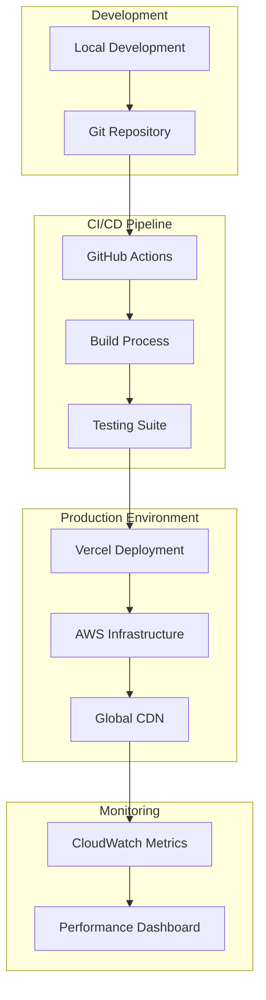

# Scuzi AI - System Architecture

## 🏗️ High-Level Architecture

## 🤖 AI Agent Flow

## 🔄 Data Flow Architecture

## 🏛️ Component Architecture

### Frontend Components
- **Navigation System**: Responsive navigation with mobile optimization
- **AI Chat Interface**: Real-time conversation with Claude 3.5 Sonnet
- **Meal Planning Dashboard**: Interactive meal plan generation and management
- **WHOOP Integration Panel**: Biometric data visualization and sync
- **Pantry Management**: Inventory tracking and shopping list generation

### Backend Services
- **Authentication Service**: Better Auth with session management
- **AI Agent Orchestrator**: Coordinates between AWS Bedrock and application logic
- **Data Processing Pipeline**: Handles WHOOP data ingestion and analysis
- **Image Generation Service**: Manages Titan G1V2 image creation workflow
- **Database Abstraction Layer**: Unified interface for MySQL and DynamoDB

### AWS Infrastructure
- **Bedrock Integration**: Claude 3.5 Sonnet v2 for AI agent capabilities
- **S3 Storage**: Scalable image and asset storage with CDN
- **Secrets Management**: Secure credential storage and rotation
- **Database Services**: RDS MySQL for structured data, DynamoDB for sessions

## 🔐 Security Architecture

## 📊 Performance Architecture

### Scalability Features
- **Serverless Functions**: Auto-scaling API endpoints
- **Database Connection Pooling**: Efficient resource utilization
- **CDN Integration**: Global content delivery via AWS CloudFront
- **Caching Strategies**: Optimized response times for frequent queries

### Monitoring & Observability
- **CloudWatch Integration**: Performance metrics and logging
- **Error Tracking**: Comprehensive error handling and reporting
- **Health Checks**: Automated system health monitoring
- **Performance Analytics**: Real-time application performance insights

## 🚀 Deployment Architecture

## 🔧 Technology Stack

### Frontend
- **Framework**: Next.js 15 with App Router
- **UI Library**: React 19 with TypeScript
- **Styling**: Tailwind CSS + Framer Motion
- **Components**: Radix UI for accessibility

### Backend
- **Runtime**: Node.js with TypeScript
- **Database ORM**: Drizzle ORM
- **Authentication**: Better Auth
- **API**: RESTful endpoints with Next.js API routes

### AWS Services
- **AI/ML**: Bedrock (Claude 3.5 Sonnet v2, Titan G1V2)
- **Storage**: S3, RDS MySQL, DynamoDB
- **Security**: Secrets Manager, IAM
- **Monitoring**: CloudWatch

### External APIs
- **Health Data**: WHOOP API with OAuth 2.0
- **Authentication**: GitHub/Google OAuth

This architecture ensures scalability, security, and optimal performance while maintaining the flexibility to add new features and integrations.